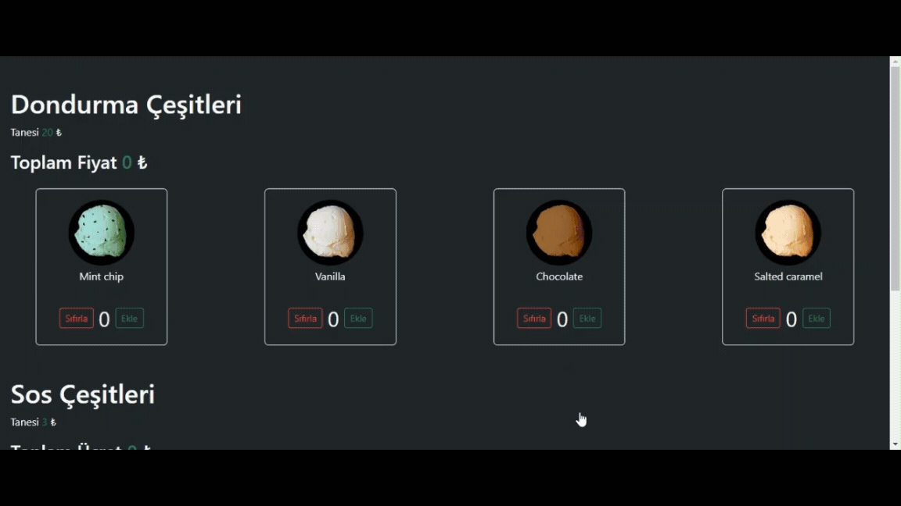

- Bu proje, kullanıcıların dondurma çeşitlerini ekleyip çıkartabileceği, sos seçebileceği ve tüm seçimlerin toplam ücretini dinamik olarak hesaplayabileceği bir React uygulamasıdır.

## Kullanılan Kütüphaneler
- React: Kullanıcı arayüzünü oluşturmak için.
- React DOM: React bileşenlerini DOM'a render etmek için.
- Axios: HTTP istekleri yapmak için.
- Bootstrap: Uygulamanın stilizasyonu için.
- JSON Server: Fake REST API oluşturmak için.
- React Testing Library: React bileşenlerini test etmek için.
- Jest DOM: Jest ile DOM testlerini kolaylaştırmak için.
- User Event: Kullanıcı etkileşimlerini simüle etmek için.
- Web Vitals: Web performans ölçümleri için.

## ScreenCast
